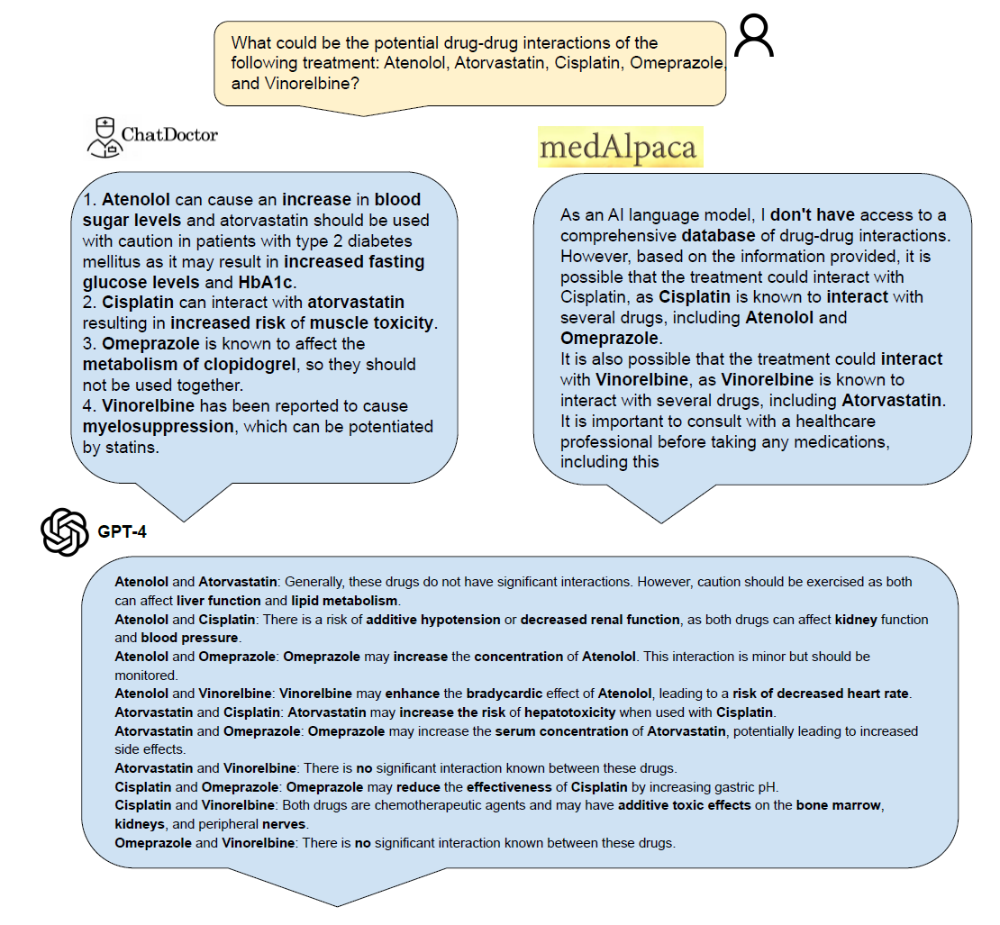
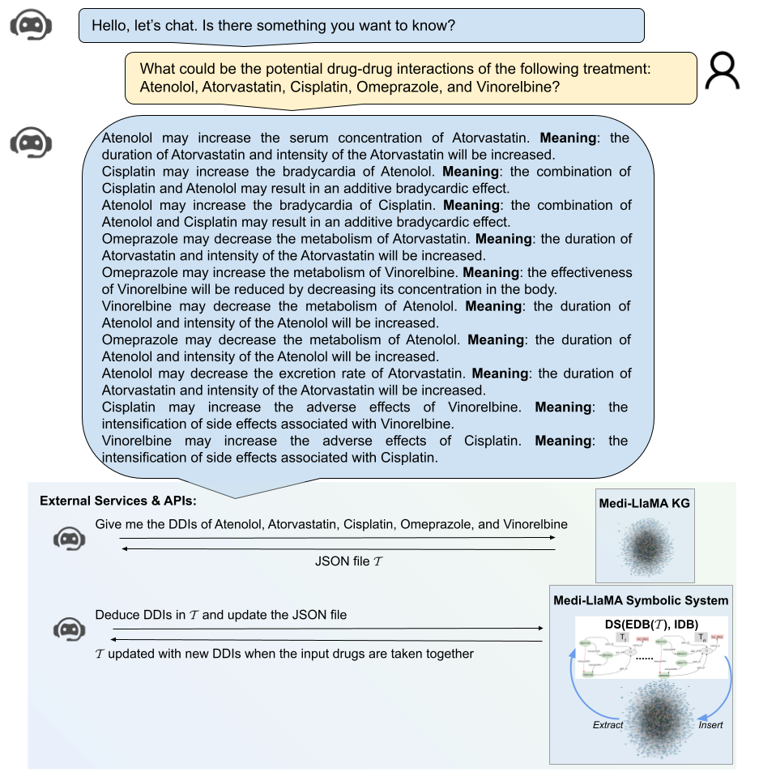

# Medi-LlaMA

A Hybrid AI system that integrates LlaMA, knowledge graphs, and symbolic reasoning and learning. This innovative system aims to identify individual conditions predisposing patients to adverse treatment responses, empowering healthcare practitioners to prioritize safety improvement and contribute to the overarching goal of universal healthcare.

# Existing Approaches

# Proposed Approach
We propose a domain-agnostic approach that can empower the predictive capacity of sub-symbolic systems with a deductive database system.
The approach retrieves the DDIs in the input treatment from the Medical Knowledge Graph (MedKG). Next, the Deductive System (DS) is called, where the DDIs extracted from the KG are part of the Extensional Database (EDB). The Intensional Database (IDB) of the DS comprises a set of rules to deduce new DDIs in treatments. A DDI is deduced when a set of drugs are taken together and is represented as a relation in the minimal model of the deductive database DS.

 
